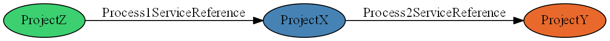
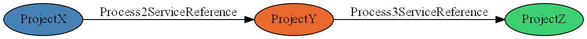
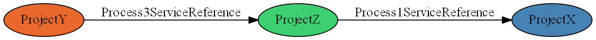

# Oracle soa suite 11g bpel project dependencies scanner #

The scanner searches for bpel projects in defined folder. Based on parsed data in composite, wsdl, xsd files  constructs compile and runtime dependencies between bpel projects.

The scanner resolves oramds: URL against defined mds project.

Based on the discovered relations you can query for sub graph of defined project and his transitive runtime/compiletime dependencies.

# Sample project #
The folder [sample](sample) contains simple SOA project with 3 BPEL project and one MDS project.

The generated scanner result for the sample project runtime dependencies:

ProjectX

ProjectY

ProjectZ

